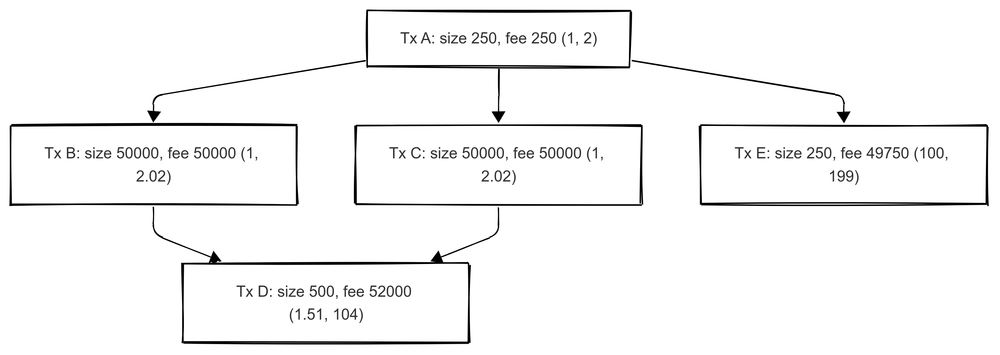

In my spare time exploring Bitcoin Core, a recent mempool redesign [proposal](https://github.com/bitcoin/bitcoin/issues/27677) caught my attention, particularly a section demonstrating how transaction eviction and mining aren't symmetrical operations. To better understand this and get hands-on experience with Bitcoin Core's testing framework, I wrote integration tests to validate this behavior.

## Quick Mempool Background

Bitcoin's mempool is where unconfirmed transactions live before being mined into blocks. The current design maintains two different sort orders: ancestor-feerate and descendant-feerate. Ancestor feerate considers a transaction's fees plus all its dependencies (parent transactions), divided by their total size. Descendant feerate looks at a transaction's fees plus all transactions that depend on it (child transactions), divided by their combined size. These sortings help determine which transactions to mine and which to evict when the mempool gets full.

## The Asymmetry Problem

The proposal includes an [example](https://github.com/bitcoin/bitcoin/issues/27677#eviction-mining-not-opposite) that illustrates the issue. Consider a transaction tree where transaction A has the lowest descendant feerate (making it a prime candidate for eviction), while one of its descendants, transaction E, has a high ancestor feerate (making it attractive for mining). This creates an interesting situation: the same set of transactions could be prioritized differently by eviction versus mining algorithms.

## Testing it Out

I wrote two integration tests to demonstrate this behavior. Both tests start by creating an identical transaction tree and filling the mempool to capacity. The key is creating the filler transactions to have:
- Higher descendant feerates than transaction A (ensuring A gets evicted first)
- Lower ancestor feerates than transaction E (ensuring E gets mined early)

I have considered a feerate of **4** (2 < 4 < 100) for the filler transactions, each being independent with no parent/child relationships in the mempool (meaning their ancestor feerate equals their descendant feerate).

The [first test](https://github.com/stringintech/bitcoin/blob/test-mempool-eviction-mining-asymmetry/test/functional/stringintech_mempool_mining_selection_test.py) generates blocks and verifies that transactions A and E are mined in the first block. The [second test](https://github.com/stringintech/bitcoin/blob/test-mempool-eviction-mining-asymmetry/test/functional/stringintech_mempool_eviction_package_test.py) adds one more transaction to trigger eviction, showing that transaction A gets evicted along with all its descendants (including E).

Through these tests, we can see the asymmetry in action: transaction E could be profitable to mine in the next block, yet it gets evicted because its ancestor (A) has the lowest descendant feerate in the mempool.

This hands-on exploration highlights why the proposed mempool redesign is looking to establish a more consistent approach to transaction selection, where eviction and mining decisions would work more consistently.
