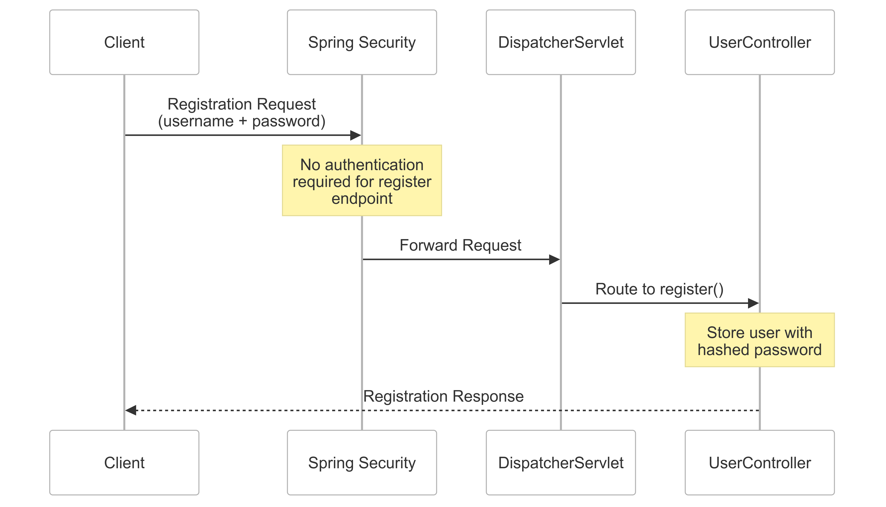
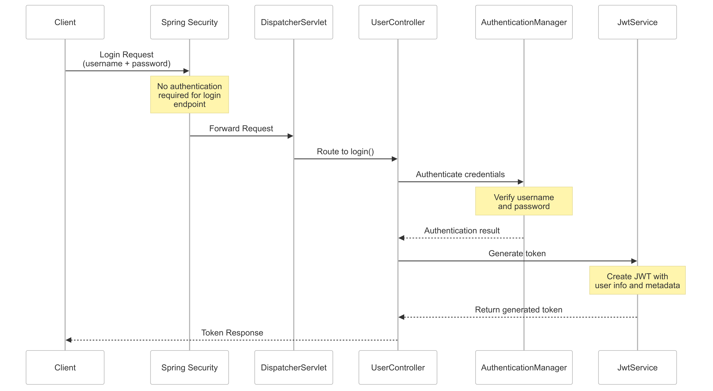
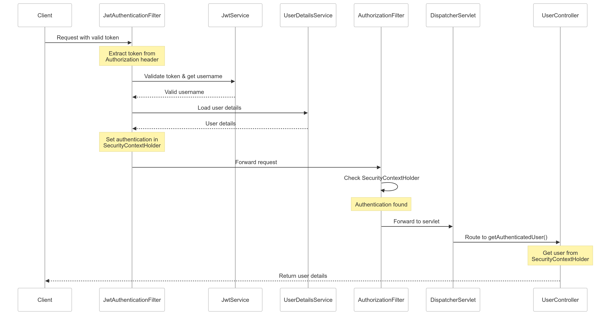
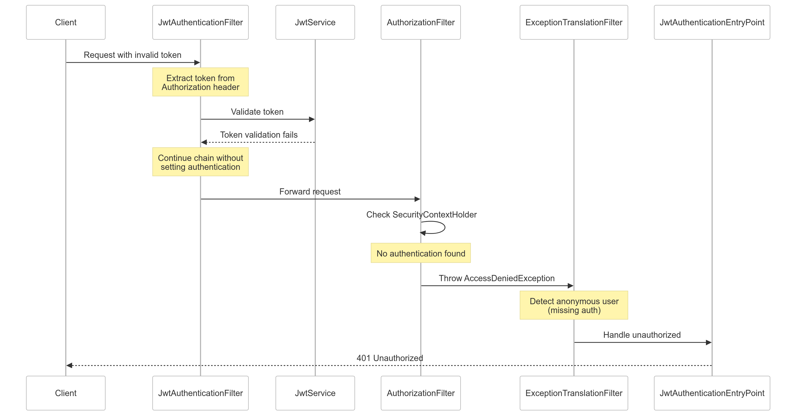

## Introduction

After setting up JWT stateless authentication (available [here](https://github.com/stringintech/security-101/tree/main/java)), I wanted to understand what happens under Spring Security's abstractions by identifying key components and their interactions. To make this exploration more engaging, I reimplemented [a minimal version](https://github.com/stringintech/security-101/tree/main/go) in Go using the standard HTTP library. By breaking down three core flows - registration, token generation, and protected resource access - and rebuilding them in Go, I set out to map Spring Security's authentication patterns to simpler components.

This post focuses specifically on authentication flows - how the system verifies user identity - rather than authorization. We'll explore the flows with sequence diagrams that trace requests through different components in Spring Security's architecture.

## Main Components

The system provides three endpoints:

1. User Registration: Accepts username and password from new users
2. Token Generation (Login): Creates a JWT token when users successfully log in with valid credentials
3. Protected Access: Enables authenticated users to access protected resources using their token. The `getAuthenticatedUser` endpoint serves as an example, returning profile information for the authenticated token holder

In the following sections, I explain the core components involved in each flow, with a sequence diagram for each.

### Registration Flow

A registration request containing username and password passes through the **Spring Security filter chain**, where minimal processing occurs since the registration endpoint was configured to not require authentication in [SecurityConfiguration](https://github.com/stringintech/security-101/blob/9be5bc387208fa8ade2edb35431ecace769f52f7/java/src/main/java/com/stringintech/security101/config/SecurityConfiguration.java#L35). The request then moves through Spring's `DispatcherServlet`, which routes it to the appropriate method in `UserController` based on the URL pattern. The request reaches UserController's [register](https://github.com/stringintech/security-101/blob/9be5bc387208fa8ade2edb35431ecace769f52f7/java/src/main/java/com/stringintech/security101/controller/UserController.java#L36) endpoint, where the user information is stored along with a **hashed** password.

### Token Generation Flow

A login request containing username and password passes through the **Spring Security filter chain**, where minimal processing occurs as this endpoint is also configured to not require authentication in [SecurityConfiguration](https://github.com/stringintech/security-101/blob/9be5bc387208fa8ade2edb35431ecace769f52f7/java/src/main/java/com/stringintech/security101/config/SecurityConfiguration.java#L35). The request moves through Spring's `DispatcherServlet` to UserController's [login](https://github.com/stringintech/security-101/blob/9be5bc387208fa8ade2edb35431ecace769f52f7/java/src/main/java/com/stringintech/security101/controller/UserController.java#L44) endpoint, which delegates to `AuthenticationManager`. Using the configured beans defined in [ApplicationConfiguration](https://github.com/stringintech/security-101/blob/main/java/src/main/java/com/stringintech/security101/config/ApplicationConfiguration.java), AuthenticationManager verifies the provided credentials against stored ones. After successful authentication, the UserController uses `JwtService` to generate a JWT token containing the user's information and metadata like creation time, which is returned to the client for subsequent authenticated requests.

### Protected Resource Access Flow

#### Successful Authentication Flow (200)

#### Failed Authentication Flow (401)

When a request containing a JWT token in its Authorization header arrives, it passes through the [JwtAuthenticationFilter](https://github.com/stringintech/security-101/blob/main/java/src/main/java/com/stringintech/security101/config/JwtAuthenticationFilter.java) - a custom defined `OncePerRequestFilter` - which processes the token using `JwtService`. If valid, the filter retrieves the user via `UserDetailsService` configured in [ApplicationConfiguration](https://github.com/stringintech/security-101/blob/9be5bc387208fa8ade2edb35431ecace769f52f7/java/src/main/java/com/stringintech/security101/config/ApplicationConfiguration.java#L25) and sets the authentication in `SecurityContextHolder`. If the token is missing or invalid, the filter allows the request to continue without setting authentication.

Later in the chain, `AuthorizationFilter` checks if the request is properly authenticated via SecurityContextHolder. When it detects missing authentication, it throws an `AccessDeniedException`. This exception is caught by `ExceptionTranslationFilter`, which checks if the user is anonymous and delegates to the configured [JwtAuthenticationEntryPoint](https://github.com/stringintech/security-101/blob/main/java/src/main/java/com/stringintech/security101/config/JwtAuthenticationEntryPoint.java) in [SecurityConfiguration](https://github.com/stringintech/security-101/blob/9be5bc387208fa8ade2edb35431ecace769f52f7/java/src/main/java/com/stringintech/security101/config/SecurityConfiguration.java#L41) to return a 401 Unauthorized response.

If all filters pass, the request reaches Spring's `DispatcherServlet` which routes it to the [getAuthenticatedUser](https://github.com/stringintech/security-101/blob/9be5bc387208fa8ade2edb35431ecace769f52f7/java/src/main/java/com/stringintech/security101/controller/UserController.java#L57) endpoint in `UserController`. This endpoint retrieves the authenticated user information from SecurityContextHolder that was populated during the filter chain process.

**Note:** Spring Security employs a rich ecosystem of filters and specialized components to handle various security concerns. To understand the core authentication flow, I only focused on the key players in JWT token validation and user authentication.

## Go Implementation: Mapping Components

The Go implementation provides similar functionality through a simplified architecture that maps to key Spring Security components:

**[FilterChain](https://github.com/stringintech/security-101/blob/main/go/auth/filter_chain.go)**
- Provides a minimal version of Spring Security's filter chain
- Processes filters sequentially for each request
- Uses a per-request chain instance ([VirtualFilterChain](https://github.com/stringintech/security-101/blob/main/go/auth/virtual_filter_chain.go)) for **thread safety**

**[Dispatcher](https://github.com/stringintech/security-101/blob/main/go/server/dispatcher.go)**
- Maps to Spring's `DispatcherServlet`
- Routes requests to appropriate handlers after security filter processing

**Authentication [Context](https://github.com/stringintech/security-101/blob/main/go/auth/context.go)**
- Uses Go's `context` package to store authentication state per request
- Maps to Spring's `SecurityContextHolder`

**[JwtFilter](https://github.com/stringintech/security-101/blob/main/go/auth/jwt_filter.go)**
- Direct equivalent to Spring's `JwtAuthenticationFilter`
- Extracts and validates JWT tokens
- Populates authentication context on successful validation

**[AuthenticationFilter](https://github.com/stringintech/security-101/blob/main/go/auth/auth_filter.go)**
- Simplified version of Spring's `AuthorizationFilter`
- Solely focusing on authentication verification
- Checks authentication context and returns 401 if missing

**[JwtService](https://github.com/stringintech/security-101/blob/main/go/auth/jwt_service.go)**
- Similar to Spring's `JwtService`
- Handles token generation and validation
- Uses same core JWT operations but with simpler configuration

## Test Coverage

Both implementations include integration tests ([auth_test.go](https://github.com/stringintech/security-101/blob/main/go/test/auth_test.go) and [AuthTest.java](https://github.com/stringintech/security-101/blob/main/java/src/test/java/com/stringintech/security101/AuthTest.java)) verifying key authentication scenarios:

**Registration Flow**
- Successful user registration with valid credentials
- Duplicate username registration attempt

**Login Flow**
- Successful login with valid credentials
- Login attempt with non-existent username
- Login attempt with incorrect password

**Protected Resource Access**
- Successful access with valid token
- Access attempt without auth header
- Access attempt with invalid token format
- Access attempt with expired token
- Access attempt with valid token format but non-existent user

The Java implementation includes detailed comments explaining the flow of each test scenario through Spring Security's filter chain. These same flows are replicated in the Go implementation using equivalent components.

## Journey Summary

I looked at Spring Security's JWT auth by breaking it down into flows and test cases. Then I mapped these patterns to Go components. Integration tests showed me how requests flow through Spring Security's filter chain and components. Building simple versions of these patterns helped me understand Spring Security's design. The tests proved both implementations handle authentication the same way. Through analyzing, testing, and rebuilding, I gained a deeper understanding of how Spring Security's authentication works.